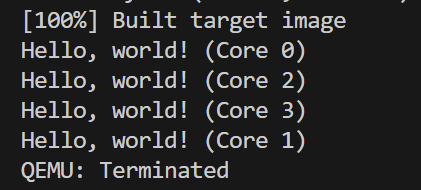

# OS (H) Report 0 
Author: Xu Yingchen (23300220005)  
Code path: <https://github.com/HydrogenC/OS-24Fall-FDU/tree/lab0>

## Execution result
`qemu make` gives the following output, as expected:  


## Implementation details
### Task 1
Just simply add the following line after calling `printk_init()`:
```
printk("Hello, world! (Core 0)\n");
```

### Task 2
In the other branch, add the following line: 
```
printk("Hello, world! (Core %llu)\n", cpuid());
```
Notably, `cpuid()` returns a `usize`, which is identical to `unsigned long long` on this platform, so we use `%lld` for formatting it.  
In `void vformat(...)`, there is: 
```
_INT_CASE("lld", i64, 10, 1)
```
Which expands to: 
```cpp
else if (strncmp(pos, "lld", sizeof("lld") - 1) == 0){
    _print_int(put_char, ctx, (i64)__builtin_va_arg(arg, i64), 10, 1);
    pos += sizeof("lld") - 1;
}
```
This builds up the actual logic of printing an `%lld`
### Task 3
From `linker.ld`, it writes: 
```
PROVIDE(edata = .);
.bss : AT(ADDR(.bss) - 0xFFFF000000000000) {
    *(.bss .bss.*) 
}
PROVIDE(end = .);
```
Which indicates that `.edata` and `.end` marks the start and end of the `.bss`.  
Thus, we use the following line to capture these two symbols. 
```
extern char *edata, *end;
```
And set the region between them to zero with: 
```
memset(edata, 0, end - edata);
```

## Extra part: Understanding `printk`
In this lab we encounter heavy usage of the function `printk`. I would like to deep into its lower level implementation in this section.  
In `print.c` we can peek the definition: 
```cpp
void printk(const char *fmt, ...)
{
    va_list arg;
    va_start(arg, fmt);
    _vprintf(fmt, arg);
    va_end(arg);
}
```
`_vprintf` wraps the function `vformat` with a spin-lock protection, whereas `vformat` does the true formatting work. `vformat` depends on a function `_put_char` for outputting chars, which forwards the call to function `putch`.  
`putch` is defined in `uart.c` as followed: 
```cpp
__attribute__((weak, alias("uart_put_char"))) void putch(char);
```
Which leads us to the function `uart_put_char`. This function drains all char to read in the buffer and then calls `device_put_u32`: 
```cpp
device_put_u32(UART_DR, c);
```
`UART_DR` is defined as followed: 
```cpp
#define UART_DR (UARTBASE + 0x00)
```
And we trace to `UARTBASE`: 
```cpp
#define UARTBASE P2V(PUARTBASE)
```
`P2V` is a macro that converts physical addresses to virtual addresses: 
```cpp
#define VA_START 0xFFFF000000000000
#define P2V(p) ((u64)(p) + VA_START)
```
So we could infer that, `UARTBASE` is the virtual address of `PUARTBASE`, and the latter (`PUARTBASE`) is the final physical address we writes to when calling `printk`.